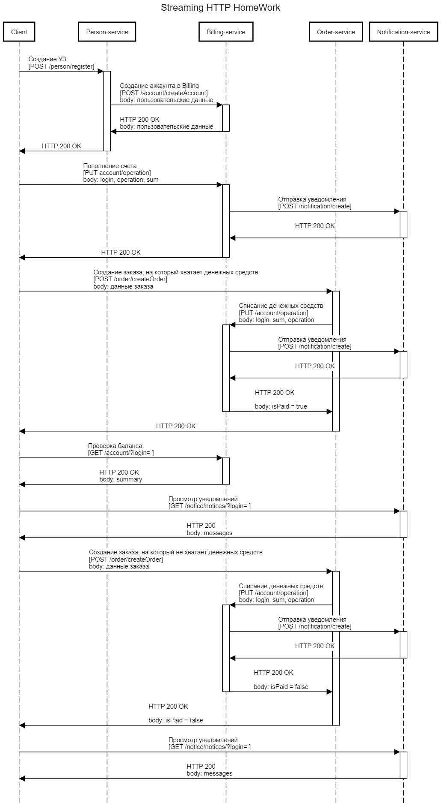
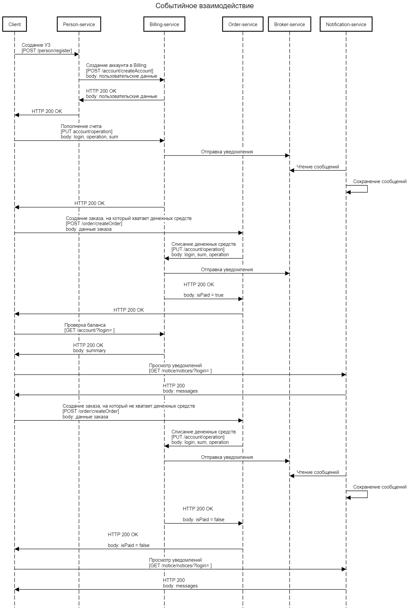
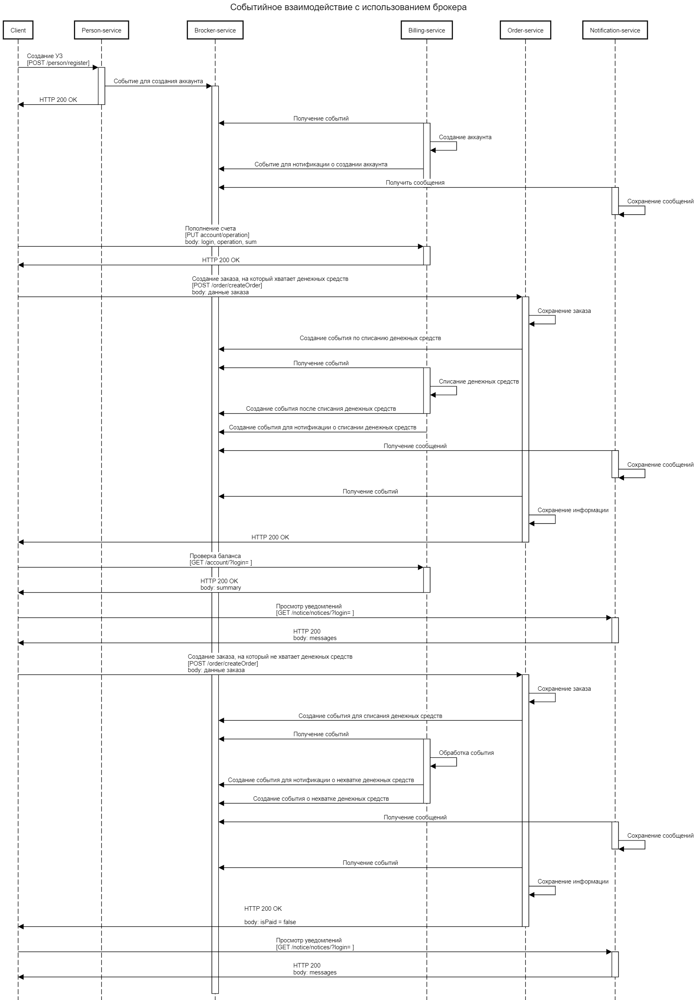

# Выполнение домашнего задания : "Паттерны поддержания консистентности данных (Stream processing)"

Установка приложения выполняется с помощью helm командой:
helm install streaming ./streaming-chart

В рамках задания было проработаны варианты взаимодействия в виде sequence диаграмм.

HTTP Взаимодействие:

Событийное взаимодействие с использованием брокера сообщений для нотификации:

Event collaboration:

Для тестирования использовать коллекцию Postman:  [коллеция postman](postman_collection.json).
При запуске через newman выводятся headers и bodies для request и response.
Команды вызова: newman run <Collection_name>